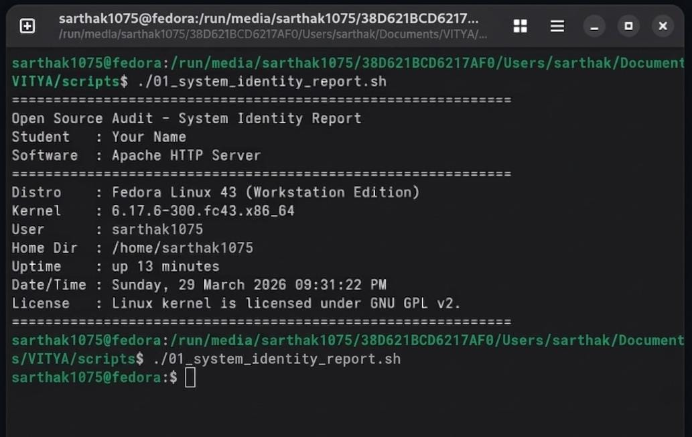
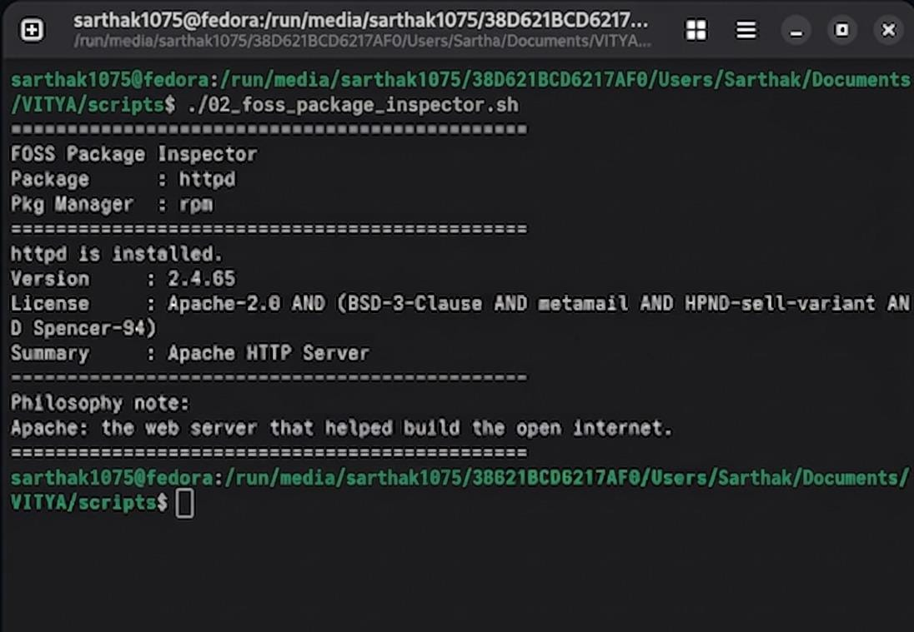
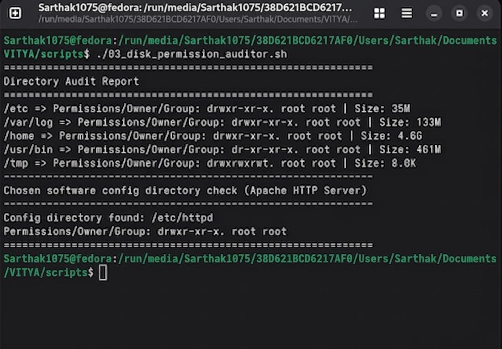
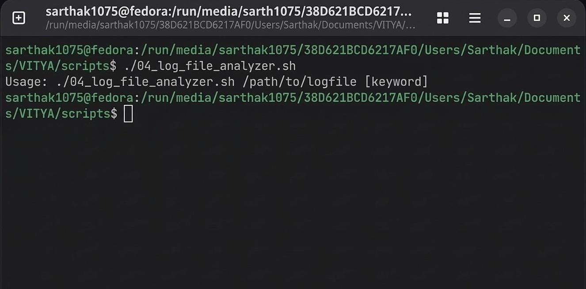
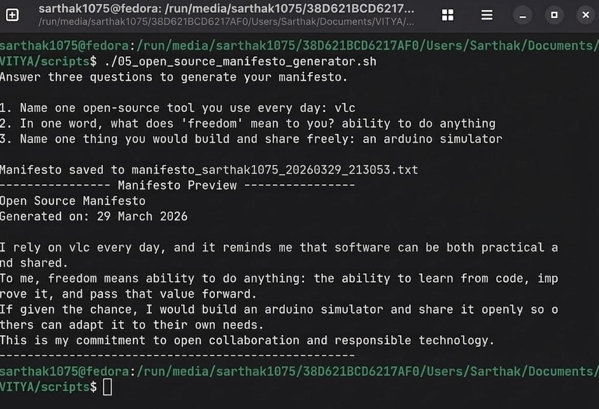

# OPEN-SOURCE-SOFTWARE-PROJECT   


Course: Open Source Software (OSS NGMC)  
Institution: VITyarthi

## Student Details

- Student Name: Sarthak Sahu    
- Registration Number: 24BCY10245   
- Chosen Software: Apache HTTP Server  
- Execution Platform: Fedora Linux 43  

## Project Structure

```text
VITYA/
├── report/
│   └── vityarthiOSS_24BCY10245_SARTHAK_SAHU.pdf  # Final Audit Report
├── scripts/
│   ├── 01_system_identity_report.sh           # Script 1: System Identity
│   ├── 02_foss_package_inspector.sh           # Script 2: Package Inspector
│   ├── 03_disk_permission_auditor.sh          # Script 3: Disk Auditor
│   ├── 04_log_file_analyzer.sh                # Script 4: Log Analyzer
│   ├── 05_open_source_manifesto_generator.sh  # Script 5: Manifesto Generator
│   └── manifesto_*.txt                        # Sample Generated Manifesto
├── Screenshots/
│   ├── script_01.jpeg                          # Evidence for Script 1
│   ├── script_02.jpeg                          # Evidence for Script 2
│   ├── script_03.jpeg                          # Evidence for Script 3
│   ├── script_04.jpeg                          # Evidence for Script 4
│   └── script_05.jpeg                          # Evidence for Script 5
├── .gitignore
└── README.md
```

## Project Objective

This project audits one open-source software project (Apache HTTP Server) from technical and philosophical perspectives.  
It also demonstrates practical Linux shell scripting through five scripts aligned with the course units.

## Dependencies

Use Fedora Linux 43 with these tools:

- bash
- coreutils (uname, whoami, uptime, date, du, cut)
- grep
- gawk
- rpm
- dnf
- systemd (systemctl)
- Apache HTTP Server package: httpd

## Setup and Execution

1. Open a Fedora 43 terminal and move to your project folder.
2. Install required packages:

   sudo dnf update -y
   sudo dnf install -y httpd git grep gawk coreutils curl

3. Start and enable Apache service:

   sudo systemctl enable --now httpd
   sudo systemctl status httpd

4. Make scripts executable:

   chmod +x scripts/*.sh

5. Run scripts one by one:
```bash
   ./scripts/01_system_identity_report.sh
   ./scripts/02_foss_package_inspector.sh httpd
   ./scripts/03_disk_permission_auditor.sh
   curl -I http://localhost
   curl -I http://localhost/nonexistent
   ./scripts/04_log_file_analyzer.sh /var/log/httpd/access_log GET
   ./scripts/04_log_file_analyzer.sh /var/log/httpd/error_log error
   ./scripts/05_open_source_manifesto_generator.sh
   ```

6. If you get permission errors on logs, rerun only Script 4 with sudo:

```bash
   sudo ./scripts/04_log_file_analyzer.sh /var/log/httpd/error_log error
```

## Script 1: System Identity Report

File: scripts/01_system_identity_report.sh

Purpose:
- Displays Linux distro, kernel, user, home directory, uptime, date/time, and license note.

Run:

```bash
./scripts/01_system_identity_report.sh
```

Concepts used:
- Variables
- Command substitution
- Output formatting

## Script 2: FOSS Package Inspector

File: scripts/02_foss_package_inspector.sh

Purpose:
- Checks whether a package is installed.
- Prints package metadata.
- Uses a case statement to show package philosophy notes.

Run examples:

```bash
./scripts/02_foss_package_inspector.sh httpd
./scripts/02_foss_package_inspector.sh mariadb
./scripts/02_foss_package_inspector.sh git
```

Concepts used:
- if-then-else
- case statement
- rpm or dpkg checks
- grep filtering

## Script 3: Disk and Permission Auditor

File: scripts/03_disk_permission_auditor.sh

Purpose:
- Loops through key Linux directories.
- Prints owner/group/permissions and total size.
- Checks Apache config directory permissions.

Run:
```bash
./scripts/03_disk_permission_auditor.sh
```

Concepts used:
- for loop
- du
- ls -ld
- awk and cut

## Script 4: Log File Analyzer

File: scripts/04_log_file_analyzer.sh

Purpose:
- Reads a log file line by line.
- Counts keyword matches.
- Implements retry logic for empty files.
- Prints last 5 matching lines.

Run examples:
```bash
./scripts/04_log_file_analyzer.sh /var/log/httpd/access_log GET
./scripts/04_log_file_analyzer.sh /var/log/httpd/error_log error
```
Concepts used:
- command-line arguments
- while read loop
- if-then checks
- counters and arithmetic

## Script 5: Open Source Manifesto Generator

File: scripts/05_open_source_manifesto_generator.sh

Purpose:
- Asks three interactive questions.
- Generates a personalized manifesto paragraph.
- Saves output to a timestamped .txt file.

Run:
```bash
./scripts/05_open_source_manifesto_generator.sh
```
Concepts used:
- read for user input
- string composition
- file write using > and >>
- date command

## Fedora 43 Test Flow

1. Confirm Fedora version:

   cat /etc/fedora-release

2. Install and start Apache:

   sudo dnf install -y httpd
   sudo systemctl enable --now httpd

3. Verify Apache process and service user:

   ps aux | grep httpd
   id apache

4. Execute Scripts 1 to 5 in order.
5. Before Script 4, create a few local requests so the log has lines:

```bash
   curl -I http://localhost
   curl -I http://localhost/nonexistent
```
6. Capture screenshots of commands and outputs for report evidence.
   
## Screenshots

### Script 1



### Script 2



### Script 3



### Script 4



### Script 5


